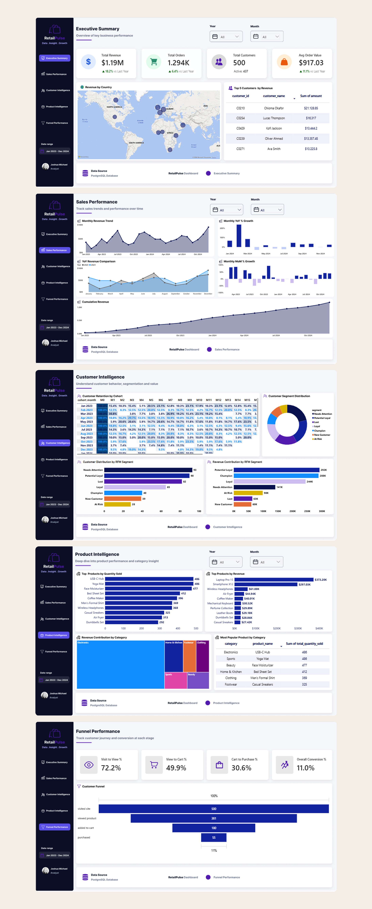
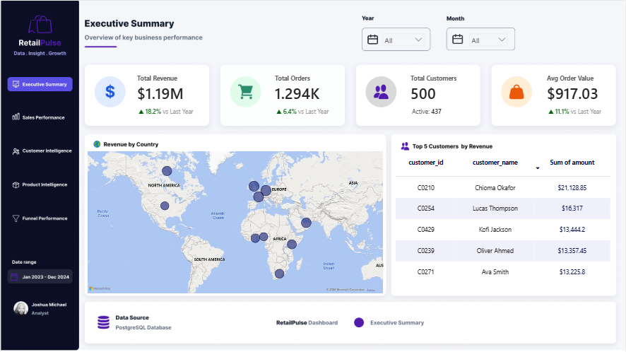
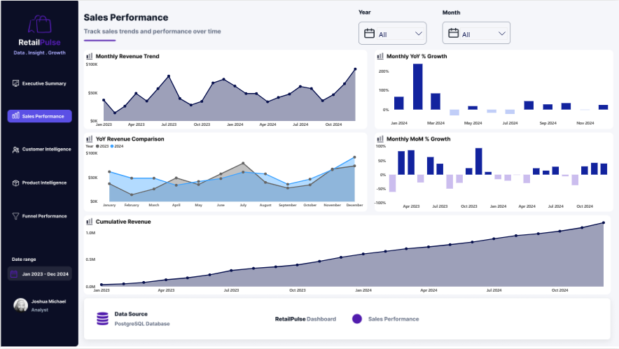
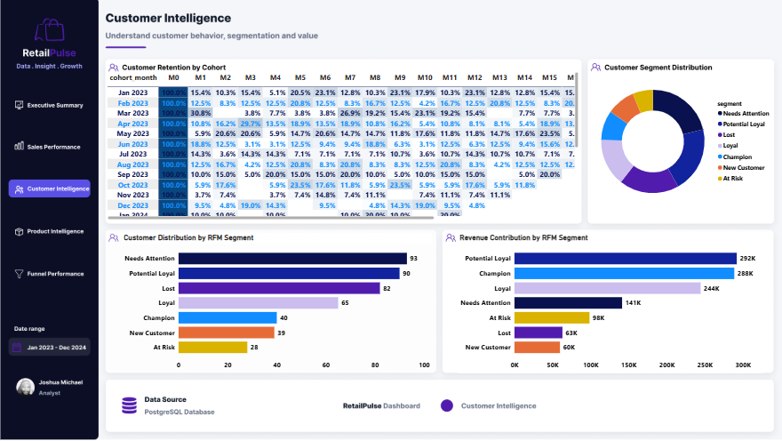
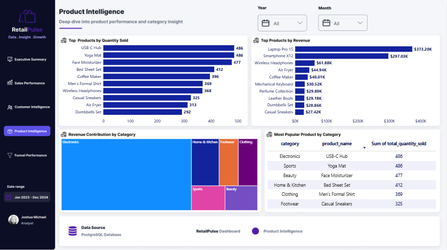
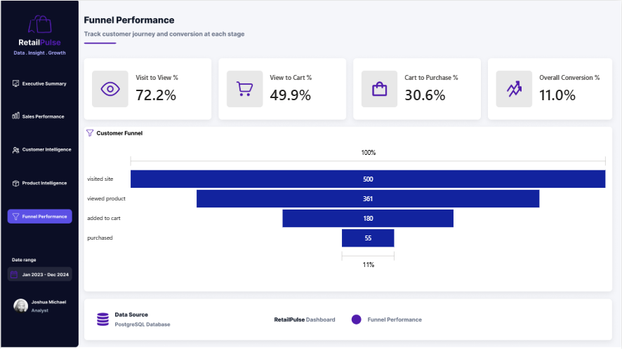

# Retail Pulse

### End-to-end retail analytics using PostgreSQL, SQL, Power BI, DAX, and Figma

[](https://app.powerbi.com/view?r=eyJrIjoiMGYyMjRjM2QtNThhMS00OTcwLTk3NDgtMWUzMmJlNjdkMzg3IiwidCI6ImExMTg4NmRiLWEzMzItNDMxOS1hNmFhLWFiMzZmODMwNjEyZCJ9)



---

## Project Overview

**Retail Pulse** is an end-to-end retail analytics project designed to evaluate sales performance, customer behavior, product contribution, and purchasing-funnel efficiency across a synthetic retail dataset covering **2023–2024**.

The project combines **PostgreSQL, SQL, Power BI, DAX, and Figma** to move from raw data to business insights and actionable recommendations.

The analysis goes beyond descriptive reporting to investigate what is happening, what the data suggests may be driving performance, and where opportunities exist to improve commercial performance.

---

## Business Objective

Identify key drivers of revenue performance and uncover opportunities to:

- Increase customer value
- Improve customer retention
- Optimize product and pricing strategies
- Reduce purchasing-funnel leakage
- Improve overall commercial efficiency

---

## Business Questions

The analysis addresses six core business questions:

1. How is the business performing, and what is driving revenue growth?
2. Which customer segments contribute the most value?
3. Which products and categories drive revenue versus volume?
4. How do pricing, demand, and product mix change seasonally?
5. Where are customers being lost within the purchasing funnel?
6. What actions could improve revenue and commercial efficiency?

---

## Data & Analytical Approach

The project uses six datasets:

- Customers
- Orders
- Order Items
- Products
- Events
- Regions

### Analytical Workflow

```text
Raw Data
   ↓
Data Validation
   ↓
PostgreSQL
   ↓
SQL Analysis & Transformations
   ↓
Analytical Views
   ↓
Power BI Data Model
   ↓
DAX Measures
   ↓
Dashboard & Interactive Analysis
   ↓
Insights & Recommendations

### SQL Analysis

PostgreSQL was used to perform:

- Revenue and order analysis
- Time-series analysis
- Customer segmentation
- RFM analysis
- Cohort and retention analysis
- Product and category analysis
- Funnel analysis
- Geographic revenue analysis

### Power BI

Power BI was used for:

- Interactive dashboard development
- KPI and metric development using DAX
- Time-based analysis
- Customer and product analysis
- Interactive filtering and exploration
- Data storytelling and visualization

---

# Dashboard

The Retail Pulse dashboard consists of five analytical pages.

## 1. Executive Summary

Provides a high-level view of business performance, including revenue, orders, average order value, geographic contribution, and customer concentration.

Key headline metrics include:

- **Revenue:** +18.2% YoY
- **Orders:** +6.4% YoY
- **AOV:** +11.1% YoY
- **Europe:** 36.5% of total revenue



---

## 2. Sales Performance

Examines revenue trends and sales stability across 2023–2024 using monthly time-series analysis.

The analysis highlights revenue growth, seasonal patterns, changes in monthly volatility, and periods requiring further investigation.



---

## 3. Customer Intelligence

Uses **RFM segmentation and cohort analysis** to understand customer value, behavior, and retention.

The analysis identifies differences in customer value across segments and highlights an early drop-off between first and second purchases.



---

## 4. Product Intelligence

Evaluates product and category contribution, sales volume, revenue concentration, and seasonal pricing patterns.

**Electronics** is the dominant revenue category, while seasonal periods show higher prices occurring alongside stronger purchasing activity. This suggests that seasonal demand may support higher price points, although further price-elasticity analysis would be required to establish causality.



---

## 5. Funnel Performance

Analyzes the customer journey from site visit to completed purchase:

**500 visitors → 361 product viewers → 180 carts → 55 purchases**

The largest conversion drop occurs between cart creation and purchase, with **69.4% of cart additions not converting to completed purchases**.

This highlights an opportunity to investigate checkout friction, payment issues, additional fees, delivery concerns, and other potential barriers to conversion.



---

# Key Findings

### Revenue Growth

Revenue increased by **18.2% YoY**, supported by both higher order volume and higher average order value.

### Revenue Concentration

Electronics generated **66.3% of total revenue**, making it the dominant revenue category. Its revenue share increased from **63.6% in 2023 to 68.6% in 2024**.

### Seasonal Performance

Key seasonal periods showed increases in revenue, orders, quantity, and AOV alongside higher product prices. The pattern suggests that seasonal demand may provide room for higher price points.

### Customer Value Concentration

A relatively small group of high-value customers contributes disproportionately to revenue. Champions represented **9.15% of active customers** while generating approximately **$288K** in revenue.

### Customer Retention

Cohort analysis indicates a noticeable reduction in customer activity after the first purchase among cohorts with an observable second month.

### Funnel Leakage

**69.4% of cart additions did not convert into completed purchases**, making checkout conversion a significant area for investigation.

---

# Recommendations

Based on the analysis, the following areas warrant further business attention:

- Protect and develop high-value customer segments through targeted retention and loyalty initiatives.
- Develop strategies to move Potential Loyal customers toward higher-value segments.
- Investigate early post-purchase engagement to improve second-purchase conversion.
- Evaluate seasonal pricing opportunities while monitoring volume, revenue, and margin impact.
- Investigate checkout friction and cart abandonment drivers.
- Monitor revenue concentration within Electronics and high-value products to manage category dependency.
- Conduct controlled price-elasticity testing before making permanent pricing changes.

---

# Technical Highlights

### Time-Series Analysis with `LAG()`

Previous-period values were calculated using SQL window functions:

```sql
LAG(revenue) OVER (
    ORDER BY month_start
) AS previous_month_revenue
```

This supported month-over-month and year-over-year comparisons.

### RFM Scoring with `NTILE()`

Customers were divided into five relative groups for Recency, Frequency, and Monetary scoring:

```sql
(6 - NTILE(5) OVER (
    ORDER BY recency_days ASC
)) AS r_score
```

Lower recency days receive stronger scores because more recent purchases indicate more recent customer activity.

### Other SQL Techniques

- Common Table Expressions (CTEs)
- Window functions
- `LAG()`
- `ROW_NUMBER()`
- `NTILE()`
- Conditional aggregation
- Cohort analysis
- RFM segmentation
- Funnel analysis
- Revenue and customer-level aggregations

---

# Project Structure

```text
Retail-Pulse/
│
├── Dashboard/
│   ├── 01_Executive_Summary.png
│   ├── 02_Sales_Performance.png
│   ├── 03_Customer_Intelligence.png
│   ├── 04_Product_Intelligence.png
│   ├── 05_Funnel_Performance.png
│   └── Retail_Pulse_Overview.png
│
├── Data/
│   ├── customers.csv
│   ├── events.csv
│   ├── order_items.csv
│   ├── orders.csv
│   ├── products.csv
│   └── regions.csv
│
├── Power_BI/
│   └── RetailPulse.pbix
│
└── SQL/
    ├── 01_business_overview.sql
    ├── 02_sales_performance.sql
    ├── 03_customer_behavior.sql
    ├── 04_product_intelligence.sql
    ├── 05_funnel_performance.sql
    ├── retail_pulse_tables.sql
    ├── vw_cohort_analysis.sql
    ├── vw_funnel_analysis.sql
    ├── vw_rfm_analysis.sql
    └── vw_top_product_per_category.sql
```

---

# Tools & Technologies

| Tool | Purpose |
|---|---|
| **PostgreSQL** | Database and analytical environment |
| **SQL** | Data analysis, transformations, and analytical views |
| **Power BI** | Interactive dashboard and data visualization |
| **DAX** | Measures and analytical calculations |
| **Figma** | Dashboard layout and visual design |
| **Git & GitHub** | Version control and project portfolio |

---

# Interactive Dashboard

Explore the full interactive Power BI dashboard:

**[View Retail Pulse on Power BI](https://app.powerbi.com/view?r=eyJrIjoiMGYyMjRjM2QtNThhMS00OTcwLTk3NDgtMWUzMmJlNjdkMzg3IiwidCI6ImExMTg4NmRiLWEzMzItNDMxOS1hNmFhLWFiMzZmODMwNjEyZCJ9)**

---

## About the Project

Retail Pulse was developed as a portfolio project to demonstrate an end-to-end analytics workflow — from raw datasets and SQL analysis to interactive dashboard development, business interpretation, and data-driven recommendations.